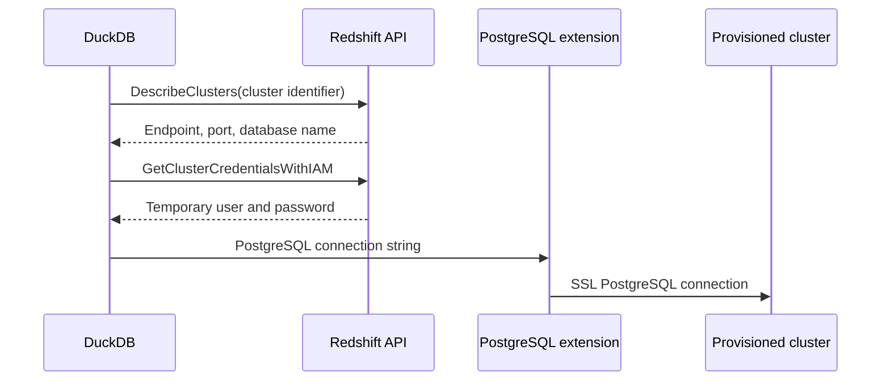
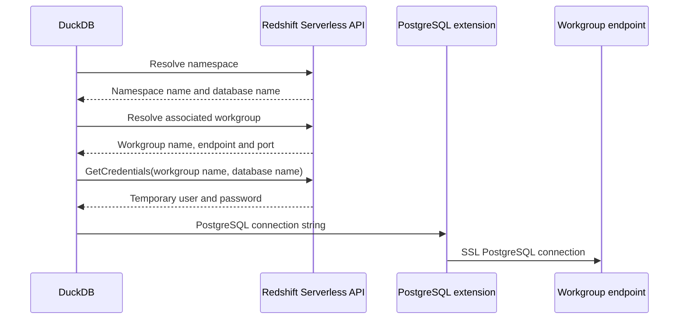

# Redshift Serverless Tests

These tests connect to Amazon Redshift Serverless through the `aws` extension.

## Serverless lifecycle

The Serverless resources are not deleted automatically. The namespace,
workgroup, databases, and security group remain until the cleanup script removes
them.

The associated namespace and workgroup are both named
`$PREFIX-redshift-serverless-$AWS_REGION`. The unassociated namespace is named
`$PREFIX-redshift-unassociated-$AWS_REGION`. Resource creation is idempotent:
rerunning the script reuses resources with the same names. Different usernames
create separate resources. Users share resources only when they use the same
`PREFIX` and region. Set `PREFIX` explicitly to choose shared or isolated
resources.

Amazon Redshift Serverless has a one-to-one relationship between namespaces and
workgroups: each namespace can have only one workgroup, and each workgroup can
be associated with only one namespace. See the AWS documentation on
[workgroups and namespaces](https://docs.aws.amazon.com/redshift/latest/mgmt/serverless-workgroup-namespace.html).

The creation order is asymmetric. A namespace can be created without a
workgroup, but a workgroup cannot be created without a namespace. The
[`CreateWorkgroup`](https://docs.aws.amazon.com/redshift-serverless/latest/APIReference/API_CreateWorkgroup.html)
API requires the name of an existing namespace, while
[`CreateNamespace`](https://docs.aws.amazon.com/redshift-serverless/latest/APIReference/API_CreateNamespace.html)
does not require a workgroup.

### Create a test environment

From the repository root:

```bash
./scripts/redshift/serverless/create_redshift_serverless_test.sh
./scripts/redshift/serverless/create_redshift_serverless_test.sh --force
source test/sql/redshift/serverless/redshift-serverless.env
```

Without `--force`, the script only lists the resources it will create. With
`--force`, it creates an associated namespace and workgroup, an unassociated
namespace, and a security group that permits the current public IP to connect
on port 5439.

The script writes `AWS_REGION`, `AWS_CONFIG_FILE`,
`AWS_SHARED_CREDENTIALS_FILE`, `AWS_PROFILE`, `ACCOUNT_ID`, `NAMESPACE_ID`,
`WORKGROUP_ID`, `UNASSOCIATED_NAMESPACE_ID`,
`AWS_REDSHIFT_SERVERLESS_NAMESPACE_ARN`, `AWS_REDSHIFT_SERVERLESS_WORKGROUP_ARN`,
`AWS_REDSHIFT_SERVERLESS_UNASSOCIATED_NAMESPACE_ARN`, `FIRST_DATABASE`, and
`SECOND_DATABASE` to
`test/sql/redshift/serverless/redshift-serverless.env`. Set
`REDSHIFT_SERVERLESS_ENV_FILE` to write these variables elsewhere.

By default, `PREFIX` is the local Unix account name returned by `id -un`,
`AWS_REGION` is `eu-central-1`, and base and maximum capacity are 8 RPUs. Set
the prefix or region explicitly, for example:

```bash
PREFIX="resource_prefix" AWS_REGION="desired_region" ./scripts/redshift/serverless/create_redshift_serverless_test.sh --force
```

The script uses `AWS_CONFIG_FILE` and `AWS_SHARED_CREDENTIALS_FILE` when they
are already set. Otherwise, it checks `~/.aws/config` and
`~/.aws/credentials`. It honors `AWS_PROFILE`, then `AWS_DEFAULT_PROFILE`; if
neither is set, it selects the `default` profile or the only available profile.
If several non-default profiles are available, set `AWS_PROFILE` explicitly:

```bash
AWS_PROFILE=<profile-name> ./scripts/redshift/serverless/create_redshift_serverless_test.sh --force
```

At least one of the AWS config or credentials files must be readable, and the
selected profile must exist in them.

Set `REDSHIFT_SERVERLESS_BASE_CAPACITY` and
`REDSHIFT_SERVERLESS_MAX_CAPACITY` to override the capacity. By default, the
script selects three subnets in distinct Availability Zones from the default
VPC. Set `REDSHIFT_VPC_ID` and provide space-separated subnet IDs through
`REDSHIFT_SUBNET_IDS` to use another VPC.

#### Test fixture data

The script creates one namespace and workgroup pair plus a second namespace
without a workgroup. The unassociated namespace verifies that a namespace ARN
cannot be attached when no workgroup supplies its connection endpoint.
Override its name and initial database with
`REDSHIFT_SERVERLESS_UNASSOCIATED_NAMESPACE` and
`REDSHIFT_SERVERLESS_UNASSOCIATED_DATABASE`.

The associated namespace contains a `duckdb_first_db` database and a
`duckdb_second_db` database. Each database contains a distinct
`public.duckdb_database_fixture` table so the test can verify explicit `DBNAME`
selection. Override their names with `FIRST_DATABASE` and `SECOND_DATABASE`.
The script uses IAM temporary credentials through the Redshift Data API, so the
caller needs `redshift-serverless:GetCredentials` in addition to the Redshift
Data API permissions.

### Destroy the test environment

After testing, remove the Serverless resources:

```bash
./scripts/redshift/serverless/destroy_redshift_serverless_test.sh
./scripts/redshift/serverless/destroy_redshift_serverless_test.sh --force
```

Without `--force`, the script only lists the resources it will destroy. With
`--force`, it deletes the workgroup, both namespaces and their databases, and
the security group.

## Run tests

### Build `postgres_scanner` locally

Redshift tests require `postgres_scanner`. The
`duckdb_extension_load(postgres_scanner ...)` block in `extension_config.cmake`
is commented out because CI cannot build it. For local Redshift development or
testing, uncomment the entire block, rebuild the extension, and do not commit
that local change.

Build the extension, create the test environment, and source
`redshift-serverless.env`. The tests also require `AWS_ACCESS_KEY_ID` and
`AWS_SECRET_ACCESS_KEY` in the environment.

Run all Redshift Serverless tests:

```bash
source test/sql/redshift/serverless/redshift-serverless.env && ./build/release/test/unittest "test/sql/redshift/serverless/*"
```

The ARN test attaches through both the namespace and workgroup ARNs, verifies
explicit database selection, and checks that attaching through an unassociated
namespace fails.

### Interactive DuckDB sessions

Start DuckDB with unsigned extension loading enabled:

```bash
./build/release/duckdb -unsigned
```

Then load the locally built `postgres_scanner` extension:

```sql
LOAD './build/release/extension/postgres_scanner/postgres_scanner.duckdb_extension';
```

## Provisioned and Serverless connection flows

### Provisioned cluster

The cluster contains nearly everything needed to connect:



### Serverless

The connection information is split between two resources:



## ARN differences

The two deployment models use different service names and resource syntax:

```text
Provisioned namespace:
arn:aws:redshift:<region>:<account>:namespace:<namespace-id>

Serverless namespace:
arn:aws:redshift-serverless:<region>:<account>:namespace/<namespace-id>

Serverless workgroup:
arn:aws:redshift-serverless:<region>:<account>:workgroup/<workgroup-id>
```
